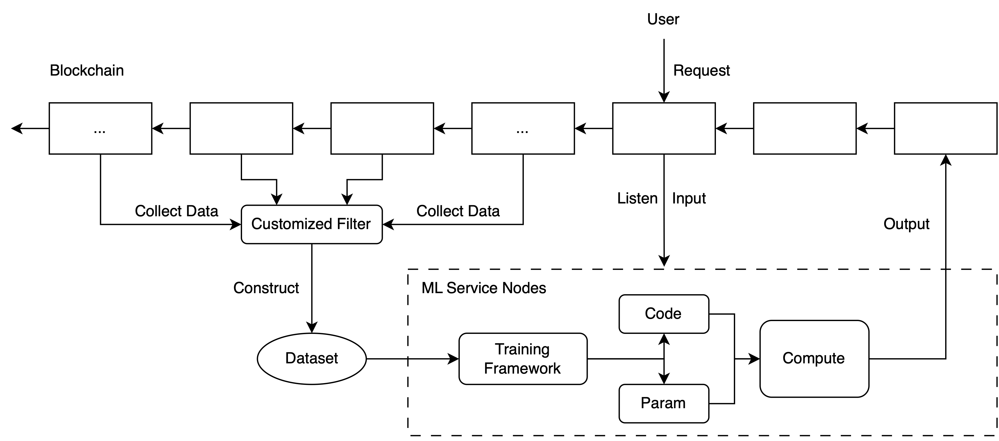

# ML2chain-template

A simple workflow template to develop ML models with on-chain data and interact with on-chain contracts using ML models.

You can brainstorm any use cases for bringing ML computation on chain.

**Notice**: This only serves as an example, and it doesn't have any ML components. We are waiting for you to fill it. Of course, you can make any modification or even implement your own workflow.

## Overview

Note: All blockchain interactions are done with nodes (e.g. Infura) or API access (e.g. Etherscan).

## Motivation

Bringing machine learning algorithms on-chain is difficult. This is because many neural network-based algorithms require lots of computation which is very expensive on EVM. If users want to deploy neural network code and model parameters on Ethereum, they need to pay a lot for on-chain storage and computation. Therefore, we deploy the neural network codes to off-chain devices, where the local computer performs various vector computations and sends the results back to the chain.

## Workflow

### 1. Dataset Construction

First, to build a machine learning model for blockchain, you have to construct the dataset. The blockchain provides a large amount of data, including, but not limited to, transaction information among different users, interaction between users and smart contracts, and interaction between smart contracts. You can get all sorts of information from a smart contract's emitted events. To get all of them, you only need to write several lines of code using existing libraries. (Some helpful codes for you to get historical data on chain can be found in [this notebook](src/utils/get_data.ipynb).)

### 2. Train your model

When you have a dataset, you can train your favorite model to analyze the data.

### 3. Fulfill users' request

After you get a model, you can fulfill other users' requests for the model computation (Or you can make it an automated process, there is plenty of space for you to customize). 

As a user, you can use similar codes as in [this file](src/utils/user.ipynb) to make your request to the coordinator contract. Users' requests include the input data, the model they want to run(modelId), the callback contract address, and the callback function in that contract.

As a ML service node operator, you can listen to other users' requests and fulfill the request using user-specified models. The ML service node operator should use the specified model, compute on the given input, and send the output back to the coordinator.

In this example, there are two contracts, one is [Coordinator](https://sepolia.etherscan.io/address/0x1B42d9Ba11180Db82C5fd902a40D769987fF1c3B), and the other is [OutputCollector](https://sepolia.etherscan.io/address/0x7f8A0D82d1f14D0976bE8AaAb0C885e3Be154c43). They have been deployed on Sepolia. You can click the above link to interact with them. The source code for the contracts is in [src/contracts](src/contracts/).

The [Coordinator](src/contracts/coordinator.sol) contract will be responsible for managing the requests from the users. The workflow of the example coordinator is as follows:

1. A user can call the `makeRequest` to upload a request to the coordinator. 
2. Then, the coordinator will emit an event including the information in that request. (requestId, modelId, input, callbackContract, and callbackFunction)
3. ML service node operators keep listening for the event in the coordinator.
4. Once one operator gets the request, it should check whether the request is fulfilled. If not, the operator will run the model with that input, and generate an output.
5. The operator then sends the output back to the coordinator contract.
6. The coordinator will call the callbackFunction in callbackContract specified by the user before.
7. Finally, that request is fulfilled. 

The example [outputCollector](src/contracts/outputCollector.sol) serves as a simple callback contract in this template. The callback function is setOutput. After the coordinator set the output in this contract, you can use [etherscan](https://sepolia.etherscan.io/address/0x7f8A0D82d1f14D0976bE8AaAb0C885e3Be154c43#readContract) to check whether the model's output has been stored in this contract.

**Notice**: The defined functions may have lots of security problems. But you can play with those codes.

## Potential Problem (Optional, Only for those who are interested)

The ML service node operator may be malicious. 

How can users verify the ML service node operator actually used the data on chain to train their models? (Since the interpretability of deep learning neural networks is a difficult problem.)

How can users verify the ML service node operator actually used the specified input to perform the inference?

How can users verify the ML service node operator actually used the model parameters or codes to perform the inference?

Actually, users know nothing about what the ML service node operator is doing in this example, because the operator doesn't upload any kind of proof for their computation or storage. 

Some related works are using ZK Proof or Fraud Proof to generate the proof for some ML computations. But many of them are still under development. We hope we can make it more secure and computationally feasible in the future.

## References:

(ZK Proof)

1. [A GitHub repository of zero-knowledge proof for machine learning](https://github.com/worldcoin/awesome-zkml)
2. [Tianyi Liu et.al. zkCNN: Zero Knowledge Proofs for Convolutional Neural Network Predictions and Accuracy](https://eprint.iacr.org/2021/673)
3. [Daniel Kang et.al. Scaling up Trustless DNN Inference with Zero-Knowledge Proofs](https://arxiv.org/abs/2210.08674)    [GitHub Repo](https://github.com/ddkang/zkml)

(Optimistic Fraud Proof)

4. [Arbitrum](https://arbitrum.io/) [Paper](https://www.usenix.org/system/files/conference/usenixsecurity18/sec18-kalodner.pdf)
5. [Optimism](https://www.optimism.io/)
